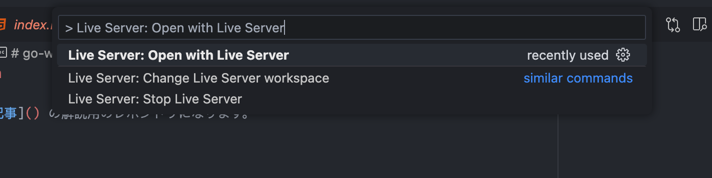
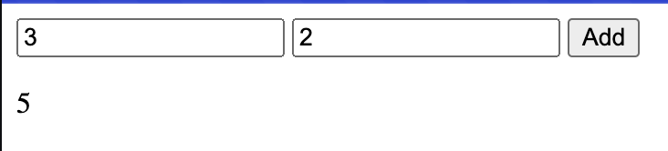

# go-wasm

[Zenn の記事](https://zenn.dev/canary_techblog/articles/47af6331b4ecfb#go-%E3%81%A7-webassembly-%E3%82%92%E4%BD%9C%E3%81%A3%E3%81%A6%E3%83%96%E3%83%A9%E3%82%A6%E3%82%B6%E3%81%A7%E5%8B%95%E3%81%8B%E3%81%97%E3%81%A6%E3%81%BF%E3%82%88%E3%81%86) の解説用のレポジトリになります。

## 使い方

`make all` で `add.go` のコンパイルと `wasm_exec.js` のコピーを行います。

Live Server 等で `index.html` を開くとブラウザで動作が確認できます。

